<div align="center">

# Throughline

### AI-assisted research where every conclusion stays connected to its evidence.

**Papers → datasets → analysis → validation → findings → reports, with the chain of evidence intact.**

<br />

[](https://github.com/SarthakPattnaik1/throughline-os/actions/workflows/ci.yml)
[](https://github.com/SarthakPattnaik1/throughline-os/actions/workflows/codeql.yml)
[](LICENSE)
[](https://www.python.org/)
[](apps/web)
[](https://throughline-research.pages.dev)

<br />

[**Try Throughline**](https://throughline-research.pages.dev) · [**Quick start**](#quick-start) · [**See what it does**](#what-throughline-can-do-today) · [**Architecture**](#system-design--engineering-architecture) · [**Contribute**](CONTRIBUTING.md)

</div>

---

## The problem

Research increasingly happens across papers, datasets, notebooks, AI chats, figures, and draft documents. The result is often a conclusion that is hard to audit: **which source supported it, which data produced it, which computation generated it, and what happened when the result was challenged?**

Throughline is built to keep that chain visible.

> **AI can help read and reason. It does not get to silently invent the analysis.**

Numerical results come from recorded scientific computation. Findings remain connected to sources, dataset versions, analyses, validation runs, figures, and reports.

| **Traceable** | **Reproducible** | **Local-first** |
|---|---|---|
| Follow a finding back to the evidence and computation that produced it. | Analyses are recorded and can be challenged, rerun, and inspected. | Core workflows run on your machine. Hosted AI is optional and explicit. |

---

## The 60-second idea

```text
Paper / source
     ↓
Dataset / evidence
     ↓
Recorded analysis
     ↓
Validation & sensitivity checks
     ↓
Finding
     ↓
Figure / report / export
```

**Throughline keeps those objects connected instead of flattening them into a chat transcript.**

A strong first demo is:

1. Add a paper or research source.
2. Add or connect a dataset.
3. Run a recorded analysis.
4. Challenge the result with validation checks.
5. Save a finding.
6. Open the finding and trace it back to the evidence and computation.
7. Export a figure or report without losing that provenance.

> [!IMPORTANT]
> **Throughline is an early research release.** It is not medical or clinical decision software. Review statistical conclusions independently, and use synthetic or non-sensitive data when evaluating a new installation.

---

## Try it

### macOS / Linux

```bash
curl -fsSL https://throughline-research.pages.dev/install.sh | sh
```

### Windows

```powershell
irm https://throughline-research.pages.dev/install.ps1 | iex
```

Then open:

```text
http://localhost:8080
```

Prefer source?

```bash
git clone https://github.com/SarthakPattnaik1/throughline-os.git
cd throughline-os
python scripts/manage.py bootstrap
python scripts/manage.py dev
```

---

## Why this is different from a generic AI research assistant

- **The model is not the calculator.** Numerical results come from scientific code.
- **Evidence stays attached.** Findings point back to the research objects that support them.
- **Validation is part of the workflow.** Results can be challenged with resampling, missingness, outlier, sensitivity, and selected confounder checks.
- **Local-first by design.** The default research workspace is yours, not a hidden hosted session.
- **Exports keep context.** Figures and reports are produced from recorded research objects rather than detached prose.

---

## What I want people to test

This project benefits most from people trying to break its assumptions.

- Can you reproduce a published result and keep the evidence chain intact?
- Can you find a workflow where provenance becomes ambiguous?
- Can you make a validation step disagree with the original result?
- Can you identify a research object that should be connected but is not?
- Can you make the local-first/security boundary fail?

If you care about reproducible AI-assisted research, **try it, open an issue, or contribute a test case.**

<div align="center">

**Current packaged release:** `v0.3.0` · **Apache-2.0** · **Python 3.12**

</div>

---

## Contents

- [Product model](#product-model)
- [What Throughline can do today](#what-throughline-can-do-today)
- [Quick start](#quick-start)
- [Why Throughline is different](#why-throughline-is-different)
- [System design & engineering architecture](#system-design--engineering-architecture)
- [Security, tenancy & trust boundaries](#security-tenancy--trust-boundaries)
- [Deployment topology](#deployment-topology)
- [Backup & recovery](#backup--recovery)
- [CI, verification & release engineering](#ci-verification--release-engineering)
- [Repository map](#repository-map)
- [Architecture decisions](#architecture-decisions)
- [Contributor design guide](#contributor-design-guide)
- [Testing](#testing)
- [Release readiness](#release-readiness)
- [Documentation](#documentation)
- [License](#license)

---

# Product model

Throughline is built around a simple idea: **research outputs should remain connected to the evidence and computation that produced them.**

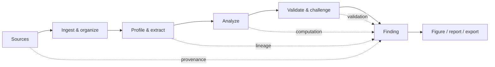

The working loop is deliberately explicit:

1. **Add sources** — papers, documents, datasets, and external records.
2. **Preserve what arrived** — metadata, files, passages, dataset versions, and origin information.
3. **Profile and understand it** — types, units, distributions, missingness, passages, and structured metadata.
4. **Define or discover analyses** — including discovery workflows with multiple-comparison correction.
5. **Execute recorded computation** — the numerical result is produced by deterministic scientific code.
6. **Challenge the result** — resampling, outliers, missingness, sensitivity checks, and selected confounder adjustment.
7. **Record a finding** — the finding points back to what produced and supports it.
8. **Communicate it** — figures, reports, and exports preserve the research chain.

A model may assist with reading or interpretation. It does **not** replace the recorded computation or provenance chain.

---

# What Throughline can do today

| Area | Current capability |
|---|---|
| **Dataset-first research** | Import → profile → explore → analyze → validate → record a finding → communicate it. |
| **Paper workflows** | Ingest documents, preserve passages/citations, locate claims, compare evidence, and connect papers to analyses. |
| **Discovery** | Explore candidate relationships and apply multiple-comparison correction rather than treating every raw p-value as independent evidence. |
| **Claim testing** | Compare a paper claim with candidate data while allowing incompatibility or insufficient evidence to be a first-class outcome. |
| **Validation** | Re-run results under resampling, outlier, missingness, sensitivity, and selected confounder checks. |
| **Pre-registration** | Record planned analyses and compare the executed analysis with the registered plan. |
| **Provenance & lineage** | Keep sources, analyses, findings, artifacts, forks, and derivations traceable. |
| **Communication** | Build provenance-aware figures, reports, and exports from recorded evidence. |
| **Visualization** | 2D and spatial/3D visualization primitives with explicit accounting for hidden or lossy representation. |
| **Imaging comparison** | Comparability-first handling for supported imaging workflows rather than naive similarity ranking. |
| **Recovery** | Back up and restore the database and object store together. |
| **AI assistance** | Optional model-assisted reading and interpretation with explicit provider boundaries. |

### Verification status matters

The **dataset-first path works end to end**. The **topic-first path** — find papers, read one into the project, locate its claims, find and import data for a claim, name the columns, state the study design, run discovery, test the claim — is walked end to end through the API with a real worker by `tests/test_the_paper_first_journey.py`, with only the network and the model stood in for. It has not yet been walked in the browser on a clean installation, so it is not yet described as a complete user flow. Individual components having tests is not treated as proof that an entire user journey is complete.

For the detailed capability truth table, use [**`docs/CAPABILITIES.md`**](docs/CAPABILITIES.md). For incomplete or planned work, see [**`ROADMAP.md`**](ROADMAP.md) and [**`docs/REQUIREMENTS.md`**](docs/REQUIREMENTS.md).

---

# Quick start

## macOS / Linux

```bash
curl -fsSL https://throughline-research.pages.dev/install.sh | sh
```

The command downloads and executes the installer. If you prefer to inspect it first, download `install.sh`, review it, and run it locally.

## Windows

There is no `sh` on a stock Windows installation, so use PowerShell instead:

```powershell
irm https://throughline-research.pages.dev/install.ps1 | iex
```

## Open Throughline

```text
http://localhost:8080
```

<details>
<summary><strong>Install from source</strong></summary>

<br />

```bash
git clone https://github.com/SarthakPattnaik1/throughline-os.git
cd throughline-os
python scripts/manage.py bootstrap
python scripts/manage.py dev
```

Run installation diagnostics with:

```bash
python scripts/manage.py doctor
```

`bootstrap` obtains the expected Python runtime when needed, creates the environment, installs workspace packages, applies migrations, and builds the web interface.

</details>

<details>
<summary><strong>Run with Docker</strong></summary>

<br />

The current container path targets `linux/amd64`.

```bash
docker build -t throughline-os .
docker run \
  -p 127.0.0.1:8080:8080 \
  -v throughline:/data \
  throughline-os
```

The mounted volume makes the local research corpus durable. A container without the data volume is a fresh workspace.

On Apple Silicon, the native bootstrap path is currently preferred over relying on x86 emulation for the embedded PostgreSQL/pgvector stack.

</details>

---

# Why Throughline is different

## Evidence first—not chat first

Throughline is built around durable research objects and their relationships. A conclusion should still be inspectable after the conversation, notebook cell, browser tab, or model response that helped produce it is gone.

## Statistics stay in the scientific runtime

Language models may help interpret, classify, locate, compare, or explain. **They do not get to become the calculator.** Numerical research results come from recorded computation.

## Missing evidence stays missing

A failed request, missing provider, skipped test, absent citation, unavailable check, or infrastructure failure is represented as missing verification—not quietly promoted into success.

## Refusal is a valid research outcome

When evidence is incompatible or insufficient, the system is designed to say so rather than manufacture certainty.

## Local-first includes recovery

If the researcher's machine holds the project, backup and restoration are part of the product contract—not an afterthought.

## Optional AI means optional

Throughline can run with **no language model configured**. There is no silent fallback from offline/local operation to a hosted provider.

---

# System design & engineering architecture

Throughline is a **local-first modular research system with explicit trust, ownership, computation, persistence, and model boundaries**. The browser is a presentation layer; the API authenticates and orchestrates; the research domain owns research rules; the scientific runtime owns numerical computation; durable state lives in PostgreSQL and object storage; background work is recoverable; and model providers remain optional.

## 1. System context

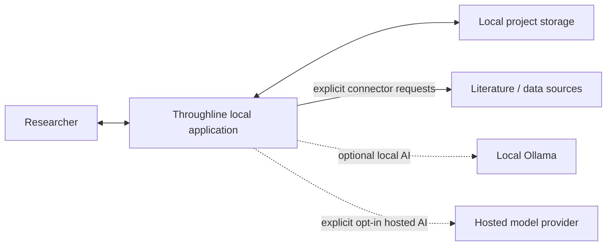

### System goals

| Goal | Engineering consequence |
|---|---|
| **Local-first operation** | Core research paths must not require a hosted SaaS dependency. |
| **Evidence traceability** | Research outputs retain identifiers and provenance links to their inputs and computation. |
| **Deterministic numerical work** | Statistical output is produced by recorded scientific code, not a generative model. |
| **Explicit external boundaries** | Network connectors and hosted models are visible choices rather than hidden fallbacks. |
| **Recoverability** | Database state and file/object state are treated as one backup/restore unit. |
| **Project isolation** | Object access is scoped server-side to the caller's project. |
| **Honest capability reporting** | Missing providers, packs, dependencies, or evidence become explicit unavailable states. |
| **Reproducible releases** | CI, release manifests, checksums, and release gates preserve evidence for the exact commit. |

### Deliberate non-goals

Throughline is not designed around:

- an AI chat transcript as the system of record;
- client-side authorization as a security boundary;
- hidden calls to hosted AI;
- a separate broker merely because background work exists;
- detached figures or reports with no path back to their evidence;
- treating skipped tests or unavailable checks as verification;
- forcing a desktop researcher to administer a database server manually.

---

## 2. Component architecture

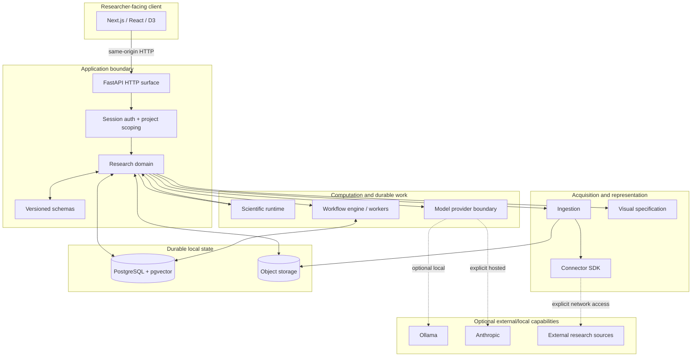

The architecture is modular without pretending to be a distributed microservice system. On the normal desktop path, these components cooperate inside a local installation and share durable local state.

---

## 3. Engineering boundaries

| Layer / package | Owns | Typical inputs | Typical outputs | Must not become |
|---|---|---|---|---|
| **`apps/web`** | Researcher workflows, UI state, visualization, interaction | API responses, user interaction | Requests, rendered evidence, next actions | Authorization authority or scientific source of truth |
| **`apps/api`** | HTTP contracts, session entry points, request orchestration, capability exposure | HTTP requests | Project-scoped responses | A giant home for domain logic |
| **`packages/research-domain`** | Claims, analyses, findings, validation, lineage, research rules | Scoped research objects | Domain decisions and persisted research state | Browser-specific logic |
| **`services/scientific-runtime`** | Deterministic numerical execution | Recorded analysis specifications + data | Results + diagnostics | Free-form model reasoning |
| **`packages/ingestion`** | File/document/dataset ingestion | Uploaded or fetched material | Normalized ingested artifacts | A trust shortcut for external content |
| **`packages/connector-sdk`** | External-source capability contracts | Search/fetch requests | External records/files | Hidden network access |
| **`packages/model`** | Model selection, prompts, structured model contracts | Bounded research context | Structured/model-assisted responses | A replacement for statistical computation |
| **`packages/schemas`** | Versioned cross-boundary structures | Domain data | Stable contracts | Unversioned ad-hoc dictionaries |
| **`packages/visual-spec`** | Visualization contracts/specifications | Research values + presentation intent | Renderable specifications | Detached evidence-free decoration |
| **`services/workers`** | Durable asynchronous/background execution | Workflow state | Completed/retryable work | An in-memory queue whose state disappears on restart |
| **PostgreSQL** | Transactional research state, project ownership, workflow state, provenance metadata | Domain transactions | Durable relational state | A disposable cache |
| **Object storage** | Source files and artifact payloads | Files/binary artifacts | Durable project objects | An independent backup universe disconnected from DB references |

### Dependency direction

The design aims for dependencies to point **inward toward stable research rules**, not outward toward presentation details.

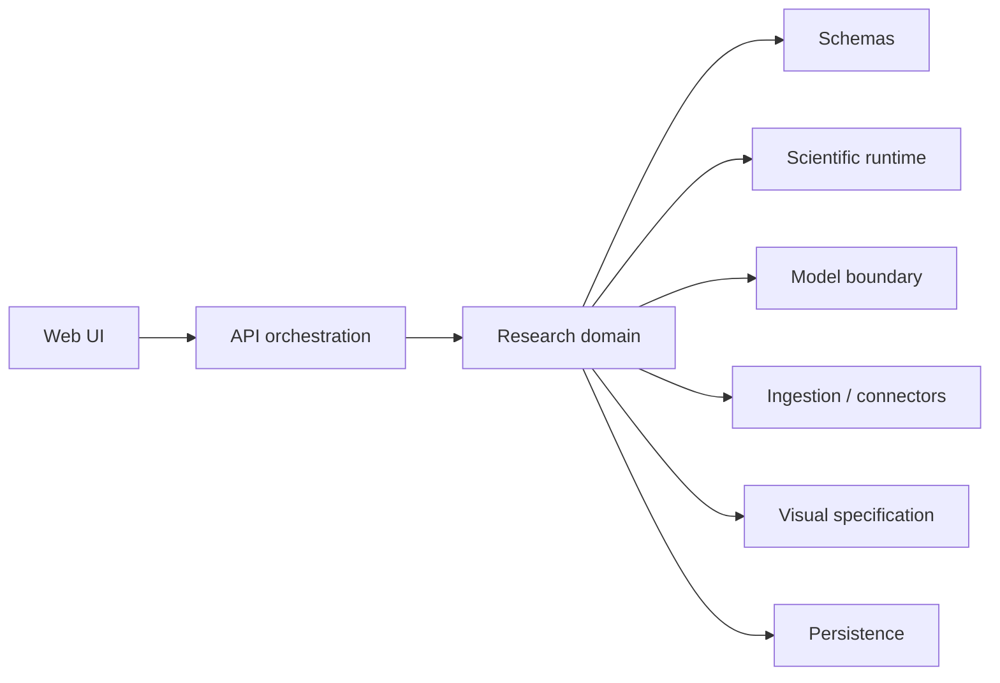

A React component should not decide whether a statistical result survived correction. A route handler should not become the only place a research rule exists. A model response should not become a numerical fact merely because it is convenient to render.

---

## 4. Research object lifecycle

The application is designed around **durable research objects**, not transient screens.

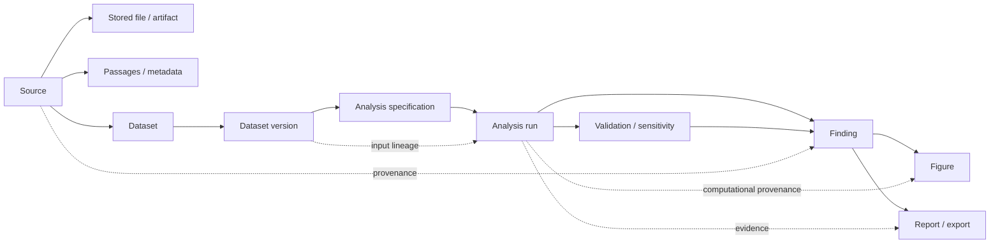

### Lifecycle principles

- **Source identity is preserved.** The system keeps the difference between what was received and what was derived.
- **Dataset versions matter.** An analysis should point to the version it actually used rather than to a mutable conceptual dataset.
- **Analysis specification precedes result interpretation.** What was run is an object worth recording.
- **Validation is evidence, not decoration.** Sensitivity and robustness checks affect what can responsibly be said about a result.
- **A finding is not merely a sentence.** It is a research object connected to supporting evidence.
- **Figures/reports are downstream artifacts.** They should be traceable back to the current research record.

### Research graph concept

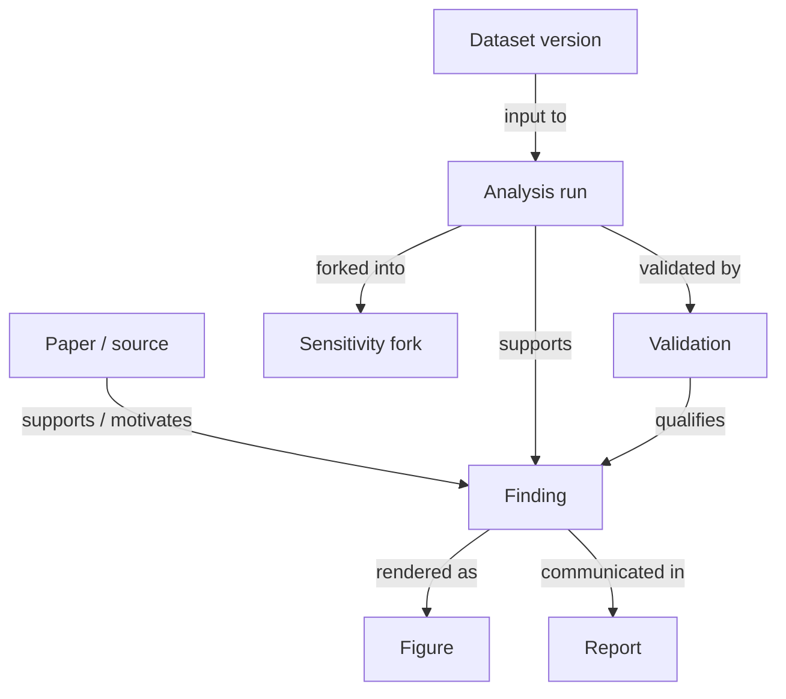

Fork lineage is kept as lineage: a sensitivity branch is not silently flattened into an unrelated run.

---

## 5. Request lifecycle

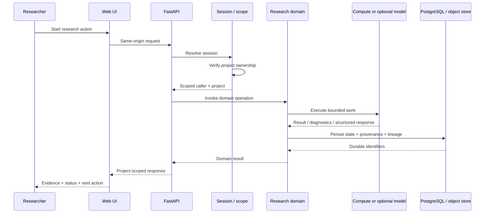

### Why scope is resolved before domain work

Object IDs are not authorization. A caller knowing another object's identifier must not make that object accessible. Project ownership is therefore enforced server-side as part of request handling rather than trusted to a filtered client view.

---

## 6. Persistence architecture

Throughline uses **real PostgreSQL** even for the local desktop target. The accepted architecture decision is to ship PostgreSQL through the Python environment rather than replacing the relational design with a desktop-only database.

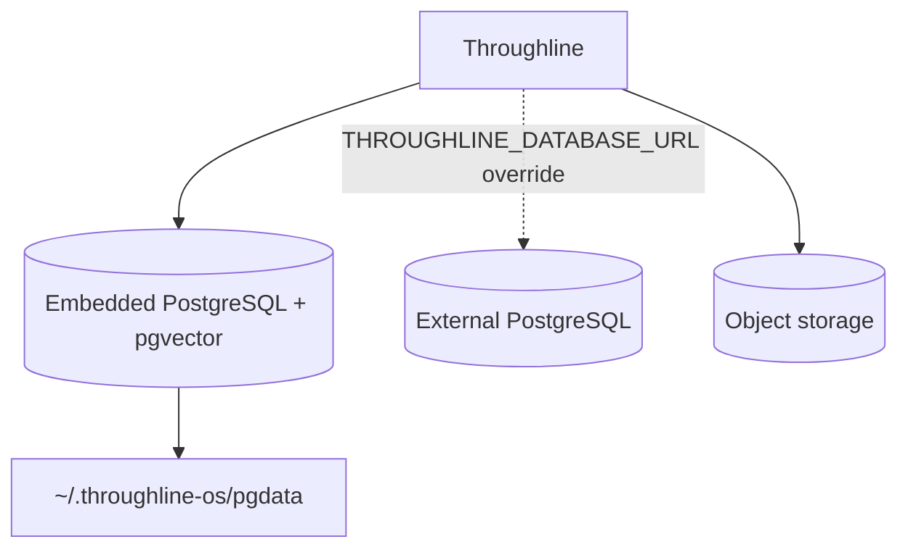

### Why PostgreSQL instead of SQLite

The desktop and potential server deployment use the same SQL dialect, extensions, and migration history. That means moving to an external PostgreSQL server is a configuration change rather than rewriting persistence logic. PostgreSQL also keeps the `vector` extension available where the product expects it.

### Storage responsibilities

| Storage | Holds | Why |
|---|---|---|
| **PostgreSQL** | users, projects, research metadata, analysis records, findings, workflow state, lineage/provenance records, transactional relationships | relational integrity + transactions + one consistent research state |
| **Object storage** | uploaded/retrieved files and binary/data artifacts referenced by project records | files do not belong inside every relational row, but their references belong in the same research record |
| **Browser-local storage in selected privacy-sensitive UI features** | narrowly scoped local-only state where persistence in the project would create an unnecessary identifier/free-text risk | keeps certain interface annotations local rather than turning them into project records |

### Persistence invariant

**Database rows and object payloads are one recovery unit.** A database backup without its referenced objects—or objects without the database that explains them—is not a complete project backup.

---

## 7. Durable workflow engine

Throughline deliberately does **not** require Redis merely to have background work. Workflow state is stored in PostgreSQL, which is already present and transactional with the research state that work produces.

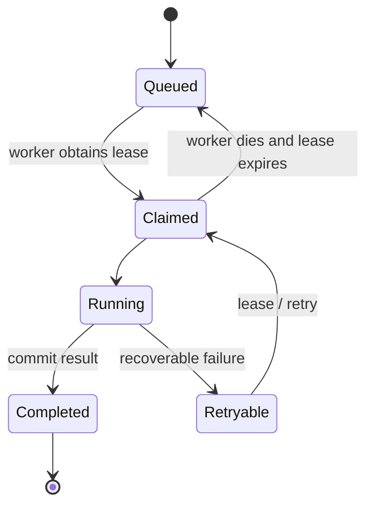

### Workflow mechanics

| Mechanism | Purpose |
|---|---|
| **Lease-based claiming** | A worker owns a run for a bounded period rather than holding a permanent lock. |
| **`FOR UPDATE SKIP LOCKED`** | Multiple workers can safely look for work without taking the same run. |
| **Lease expiry** | Work can be reclaimed if a worker dies mid-flight. |
| **Idempotency keys** | Repeating enqueue does not have to create duplicate logical work. |
| **Node-level state** | A resumed workflow can skip completed work rather than paying for it twice. |
| **Transactional persistence** | Workflow state can commit consistently with the research data it created. |

### Why this fits the desktop target

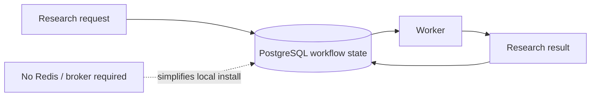

At desktop scale, avoiding another daemon is more valuable than optimizing queue throughput that the product does not need. The workflow interface remains narrow enough that a different durable engine could be introduced if the deployment model changes later.

---

## 8. Scientific execution

The scientific runtime is the boundary where **recorded analysis intent becomes deterministic numerical output**.

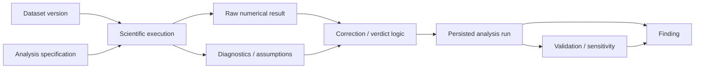

### Scientific design rules

- **The specification is recorded.** A result should be tied to what was actually requested.
- **The dataset version is recorded.** Reproducibility depends on knowing which data was used.
- **Correction belongs with the analysis family.** Discovery results are not reinterpreted later with an arbitrary hard-coded threshold.
- **Diagnostics travel with the result.** A headline number without its assumptions and warnings is incomplete evidence.
- **Validation does not rewrite history.** Sensitivity work becomes related evidence rather than silently replacing the original run.
- **Reference conformance is tested.** Statistical implementations are checked against external reference implementations where an appropriate reference exists.

### Discovery and correction

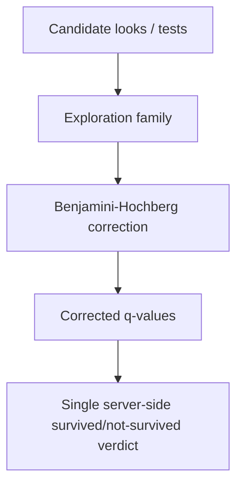

A corrected discovery verdict is meant to have **one owner and one definition**. Downstream screens should display the recorded verdict rather than independently re-deriving it with their own threshold.

### Pre-registration relationship

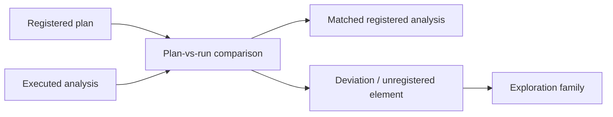

The system can identify what changed; it does not infer misconduct or invent a researcher's reason for a deviation.

---

## 9. Ingestion & connector boundary

Ingestion is where untrusted external material crosses into a local project. The important design rule is that **retrieved content is data, not authority**.

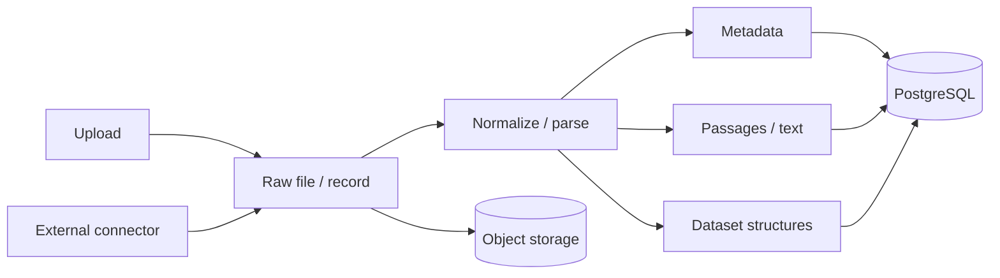

### Boundary rules

- Network access comes through explicit connector behavior.
- A retrieved paper can contain instructions in its prose; those instructions are still just document content.
- Original source identity and metadata are kept separate from derived structures.
- A partial external outage should be represented as partial/missing acquisition rather than fabricated completeness.
- Withdrawal from a source repository is not automatically called a retraction; the external feed may not justify that stronger claim.

---

## 10. Optional model boundary

Throughline can operate with **no model provider at all**.

| Provider | Location | Behavior |
|---|---|---|
| `none` | nowhere | Model-assisted features are unavailable; deterministic workflows continue. |
| `ollama` | local | Model-assisted features can run on the researcher's own machine. |
| `anthropic` | hosted | Selected bounded research context is sent to the configured hosted provider. |

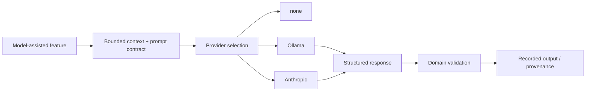

### Model boundary invariants

- **No silent hosted fallback.** A local/offline setup does not quietly become a hosted-data flow.
- **Prompts are contracts.** Model-assisted operations use defined prompts/structured schemas rather than arbitrary UI strings becoming hidden system behavior.
- **Retrieved text is untrusted context.** Document content does not become model instruction authority.
- **Numerical truth stays outside the model.** The model can explain a stored result but does not invent the underlying statistical result.
- **Unavailability is explicit.** If a model-required feature cannot run, unrelated deterministic workflows should remain usable.

---

## 11. Provenance & lineage

Provenance is not a post-processing feature. It is written as research work is created.

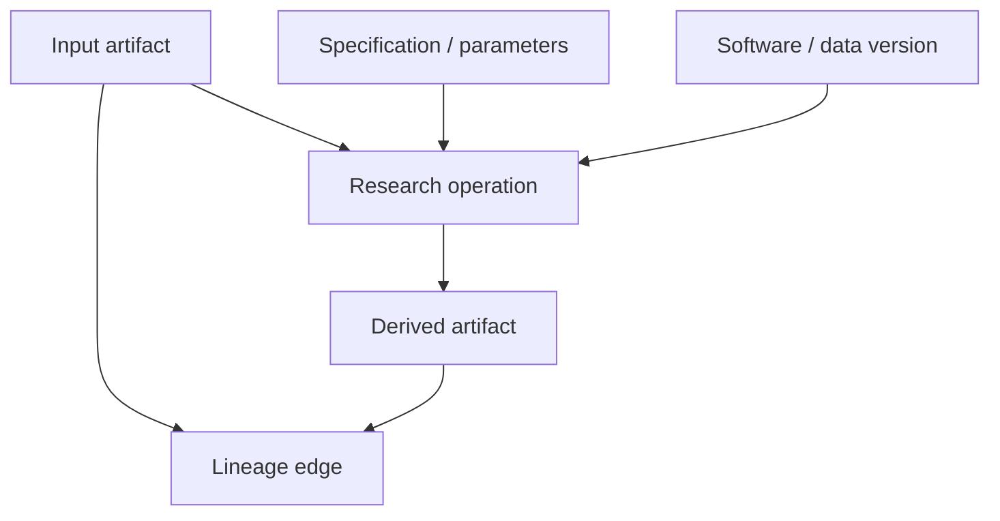

### Provenance questions the architecture is designed to answer

- Which source or dataset version fed this analysis?
- Which specification and parameters produced this run?
- Was this run forked from another run, and why?
- Which validation checks qualify this finding?
- Which figure/report was generated from which current research state?
- Has an export become stale because the underlying numbers changed?
- Does a withdrawn source still support something in the project?

### Export staleness concept

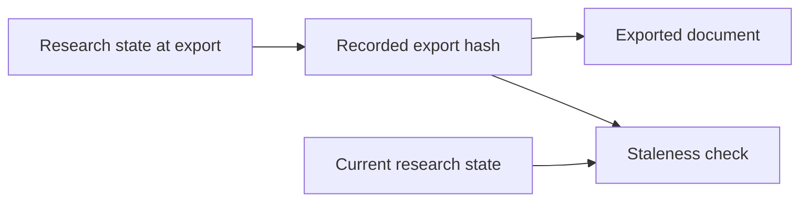

The system distinguishes “the document was edited” from “the underlying research state changed.” Those are not the same failure mode.

---

## 12. Visualization & imaging

Visualization is treated as a research representation problem, not simply a chart-library problem.

### Visualization architecture

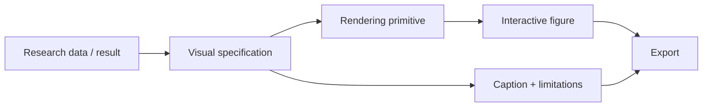

The spatial catalogue currently records **253 named visualizations**, with **216 rendered today** through reusable primitive families. The catalogue keeps “a renderer is missing” separate from “an external reader/kernel is required,” because those are different engineering gaps.

### 3D primitive families

| Primitive family | Role |
|---|---|
| `surface` | surfaces and height-like spatial structures |
| `points` | point clouds and spatial samples |
| `network` | graph/network spatial structures |
| `glyphs` | vectors, tensors, and field glyphs |
| `volume` | voxel/volumetric representations |
| `lines` | trajectories, streamlines, paths, orbits |
| `isosurface` | constant-value shells and boundaries |
| `bars` | framed spatial bar representations with explicit distortion caveats |

Spatial representations are expected to disclose what depth, sampling, clipping, or occlusion hides rather than presenting a 3D view as lossless truth.

### Imaging design principle

For supported imaging workflows, **comparability comes before resemblance**. Acquisition differences can dominate apparent similarity, so a system that simply ranks “similar-looking” scans can imply a clinical relationship the data does not support.

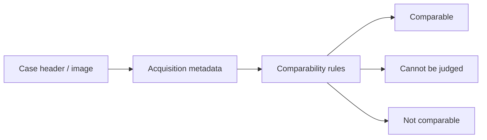

See [`docs/CAPABILITIES.md`](docs/CAPABILITIES.md) for the detailed visualization and imaging behavior, including format-specific limitations.

---

## 13. Failure & degraded modes

A trustworthy research system has to describe failure as carefully as success.

| Condition | Expected system behavior | What must **not** happen |
|---|---|---|
| **No model configured** | Deterministic workflows continue; model-required features report unavailable | silently call a hosted model |
| **Local model unreachable** | Model-assisted feature reports unavailable/retryable state | break unrelated analysis |
| **External literature/data source fails** | Preserve successful responses and identify missing/failed source where supported | invent complete search coverage |
| **Optional capability pack absent** | Capability is reported unavailable with a path to enable it | opaque crash |
| **Analysis fails** | Record/report failure without promoting a finding | fabricate a result |
| **Worker dies** | Lease expires and durable work can be reclaimed | permanently strand in-memory work |
| **Foreign project object ID supplied** | Reject without exposing the private object | trust the ID because the client sent it |
| **Validation unavailable** | Finding remains without that verification | imply validation passed |
| **CI job skipped/cancelled/infrastructure-blocked** | Treat verification as missing | count it as a pass |
| **Incomplete backup** | Do not treat it as a complete recovery point | restore DB and silently lose referenced objects |
| **Release evidence missing** | Do not call the commit release-ready | equate public source with verified release |

---

# Security, tenancy & trust boundaries

## Project is the current tenancy unit

The accepted design is:

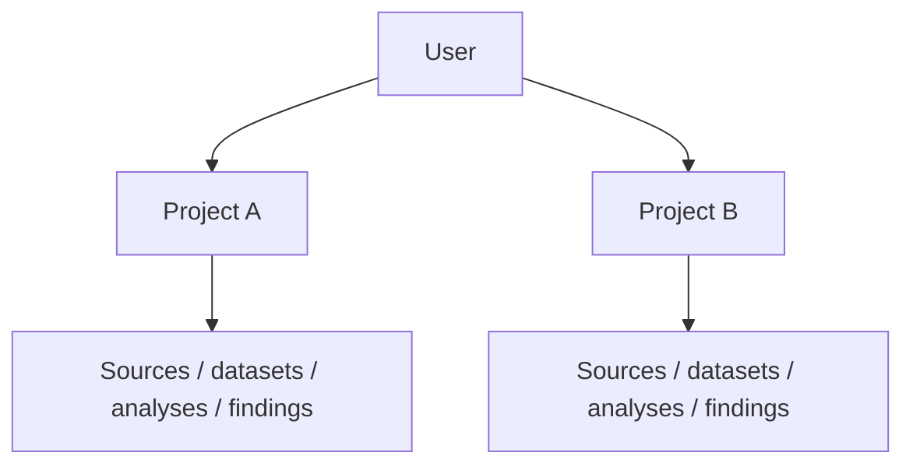

The schema is intentionally **`users → projects → research objects`** today. Organization/workspace tiers are not fabricated ahead of a real hosted/team requirement. Every research table is designed around project scoping so higher tenancy layers can be added later without reshaping every research object.

## Ownership enforcement

Project ownership is checked server-side. Security-sensitive code follows the principle that another account's private object should generally be indistinguishable from an object that does not exist.

```mermaid
sequenceDiagram
    participant C as Caller
    participant A as API
    participant P as Project scope
    participant O as Requested object

    C->>A: Request object ID
    A->>P: Resolve caller's project
    P->>O: Query within project scope
    alt object belongs to caller project
        O-->>A: object
        A-->>C: permitted response
    else foreign or absent
        O-->>A: no scoped object
        A-->>C: non-success without private disclosure
    end
```

The test suite includes route-derived cross-account/project ownership checks so ID-bearing API routes are exercised against a second account/project rather than relying only on code review.

## Trust zones

```mermaid
flowchart LR
    subgraph T1[Trusted local identity]
        SESSION[Authenticated session]
    end

    subgraph T2[Project trust boundary]
        SCOPE[Server-side project scope]
        DOMAIN[Research domain]
        STORE[Project persistence]
    end

    subgraph T3[Untrusted research content]
        DOC[Uploaded/retrieved documents]
        EXT[External metadata]
    end

    subgraph T4[Optional external compute]
        HOST[Hosted model]
    end

    SESSION --> SCOPE
    SCOPE --> DOMAIN
    DOMAIN --> STORE
    DOC --> DOMAIN
    EXT --> DOMAIN
    DOMAIN -. explicit provider use .-> HOST
```

### Security invariants

- authorization is enforced server-side;
- project scoping is not delegated to UI filtering;
- external document text is untrusted content;
- hosted model use is explicit;
- secrets and credentials do not belong in research artifacts or public issues;
- installation-wide operations require the appropriate server-side role;
- network sign-up is off by default;
- security changes need regression tests for the concrete cross-account path they protect.

Please report vulnerabilities privately as described in [**`SECURITY.md`**](SECURITY.md).

> [!CAUTION]
> Do not put private datasets, unpublished research, credentials, database exports, session cookies, API keys, or personal information into public GitHub issues or pull requests.

---

# Deployment topology

## Native local deployment

```mermaid
flowchart LR
    B[Browser]
    APP[Python Throughline application]
    WEB[Built Next.js interface]
    API[FastAPI]
    PG[(Embedded PostgreSQL)]
    OBJ[(Local object storage)]
    SCI[Scientific runtime]
    O[Optional Ollama]
    H[Optional hosted provider]

    B -->|localhost:8080| APP
    APP --> WEB
    APP --> API
    API --> PG
    API --> OBJ
    API --> SCI
    API -. local model .-> O
    API -. explicit hosted model .-> H
```

The normal app presents one local origin on port `8080`. Authentication uses an `httpOnly`, `SameSite=strict` session cookie. Node is needed to build the web interface from source; the built interface is served by the Python application rather than requiring a second Node server at runtime.

## PostgreSQL deployment choice

The local installation uses real PostgreSQL shipped via the Python environment and stores its data under `~/.throughline-os/pgdata`. `THROUGHLINE_DATABASE_URL` can point the application at an external PostgreSQL server instead.

That preserves one persistence model across desktop and future server-style deployments.

## Docker path

```mermaid
flowchart LR
    HOST[Host browser]
    CONTAINER[Throughline container]
    VOL[(Persistent /data volume)]

    HOST -->|127.0.0.1:8080| CONTAINER
    CONTAINER --> VOL
```

The container should be treated as replaceable; the mounted data volume is what makes the local project durable.

---

# Backup & recovery

A local-first product needs a recovery design, not just an export button.

```mermaid
flowchart LR
    DB[(PostgreSQL)]
    OBJ[(Object storage)]
    BACK[Backup operation]
    ARCH[Backup archive]
    REST[Restore operation]
    DB2[(Restored PostgreSQL)]
    OBJ2[(Restored objects)]

    DB --> BACK
    OBJ --> BACK
    BACK --> ARCH
    ARCH --> REST
    REST --> DB2
    REST --> OBJ2
```

```bash
./scripts/backup.sh
./scripts/restore.sh <archive.tar> [--force]
```

### Recovery invariants

- database and object storage are backed up together;
- restore is allowed to be conservative rather than overwrite live state casually;
- release readiness includes restore rehearsal rather than assuming a backup is valid because an archive file exists;
- migration/update operations are expected to preserve a recovery path.

## Updates

Updates are deliberate rather than automatic:

```bash
python scripts/manage.py update --check
python scripts/manage.py update
```

The updater backs up before migration, uses fast-forward semantics, and reports recovery information when an update cannot complete cleanly.

---

# CI, verification & release engineering

## Pull-request quality gate

```mermaid
flowchart LR
    PR[Pull request]
    U[Ubuntu backend]
    M[macOS backend]
    W[Windows sandbox]
    WEB[Web tests + lint + build]
    D[Docker build + health]
    Q[CodeQL]
    RULE[Protect Main ruleset]
    MAIN[main]

    PR --> U
    PR --> M
    PR --> W
    PR --> WEB
    PR --> D
    PR --> Q
    U --> RULE
    M --> RULE
    W --> RULE
    WEB --> RULE
    D --> RULE
    Q --> RULE
    RULE --> MAIN
```

The protected `main` branch requires the cross-platform/product checks and CodeQL. Force pushes and branch deletion are blocked, linear history is required, and changes land through pull requests.

## Verification philosophy

```mermaid
flowchart TB
    CHECK[Check requested]
    PASS{Did evidence complete successfully?}
    YES[Verified for that check]
    NO[Missing or failed verification]

    CHECK --> PASS
    PASS -->|yes| YES
    PASS -->|no / skipped / cancelled / infra blocked| NO
```

A workflow that did not run successfully is not converted into a passing result simply because the cause was infrastructure.

## Release pipeline

```mermaid
flowchart LR
    COMMIT[Exact commit]
    CI[Required verification]
    CLEAN[Clean checkout]
    BUILD[Release builder]
    ALLOW[Path allowlist]
    ARCH[Release archive]
    HASH[SHA-256 + manifest]
    SIGN[Signature evidence]
    PUB[Publication]

    COMMIT --> CI
    CI --> CLEAN
    CLEAN --> BUILD
    BUILD --> ALLOW
    ALLOW --> ARCH
    ARCH --> HASH
    HASH --> SIGN
    SIGN --> PUB
```

Build release artifacts with:

```bash
python scripts/manage.py release
```

The release builder uses an allowlist of paths, refuses a dirty checkout, emits a SHA-256 digest and manifest, and supports signed update verification. See [`keys/README.md`](keys/README.md) for signing details.

Public source code and a verified release are deliberately different claims. The full release evidence checklist lives in [`docs/PUBLIC_RELEASE_GATE.md`](docs/PUBLIC_RELEASE_GATE.md).

---

# Repository map

```text
throughline-os/
├── apps/
│   ├── api/                    FastAPI HTTP/application surface
│   └── web/                    Next.js researcher interface
│
├── packages/
│   ├── schemas/                Versioned domain schemas
│   ├── model/                  Model providers + prompt contracts
│   ├── research-domain/        Evidence, analyses, lineage, findings, workflows
│   ├── connector-sdk/          External connector interfaces + capabilities
│   ├── ingestion/              Document and dataset ingestion
│   └── visual-spec/            Visualization specifications + rendering contracts
│
├── services/
│   ├── workers/                Durable background workflow execution
│   └── scientific-runtime/     Deterministic scientific computation
│
├── docs/                       Architecture, ADRs, capabilities, requirements,
│                               security/release evidence and design notes
├── tests/                      Cross-package regression and invariant tests
├── evals/                      Statistical/evaluation harnesses
├── scripts/                    Bootstrap, diagnostics, backup, update, release,
│                               verification and maintenance tooling
├── keys/                       Release-signing documentation/material contracts
├── .github/                    CI, CodeQL, Dependabot, issue/PR templates
├── ROADMAP.md                  Planned/incomplete product work
├── TASKS.md                    Task/evidence ledger
├── CONTRIBUTING.md             Contributor workflow
├── SECURITY.md                 Security policy and reporting
└── README.md                   Product + engineering entry point
```

### Code ownership by concern

| If you are changing… | Start by looking in… |
|---|---|
| researcher interaction / screen behavior | `apps/web` |
| HTTP endpoint or transport contract | `apps/api` |
| research semantics / findings / lineage / validation | `packages/research-domain` |
| a cross-package object contract | `packages/schemas` |
| deterministic numerical execution | `services/scientific-runtime` |
| model provider / prompt contract | `packages/model` |
| document/dataset parsing | `packages/ingestion` |
| external source integration | `packages/connector-sdk` |
| visualization specification | `packages/visual-spec` |
| durable asynchronous work | `services/workers` |
| installation/update/release/recovery | `scripts` + relevant docs/tests |

---

# Architecture decisions

The repository records architectural decisions explicitly instead of leaving major tradeoffs implicit in code.

| ADR | Decision | Why it matters |
|---|---|---|
| [`ADR-0001`](docs/ADR-0001-embedded-postgres.md) | **Use embedded real PostgreSQL** | Desktop install keeps the same SQL/pgvector/migration model as an external deployment; SQLite divergence is avoided. |
| [`ADR-0002`](docs/ADR-0002-project-as-tenancy-unit.md) | **Project is the scoping unit** | Current schema stays honest to the single-researcher/local target while every research object remains project-scoped for later tenancy expansion. |
| [`ADR-0003`](docs/ADR-0003-durable-workflows-in-postgres.md) | **Durable workflows live in PostgreSQL** | No Redis/broker is required for desktop use; leases, idempotency, and workflow state remain transactional with research data. |

### Architecture decision hierarchy

```mermaid
flowchart TB
    PRODUCT[Product constraint: local-first research]
    A1[Embedded PostgreSQL]
    A2[Project-scoped tenancy]
    A3[PostgreSQL durable workflows]
    OUT[Lower operational burden + consistent research state]

    PRODUCT --> A1
    PRODUCT --> A2
    PRODUCT --> A3
    A1 --> OUT
    A2 --> OUT
    A3 --> OUT
```

---

# Contributor design guide

## Where should new code live?

```mermaid
flowchart TB
    START[New change]
    UI{Presentation / interaction only?}
    HTTP{HTTP transport / route?}
    DOMAIN{Research rule or object behavior?}
    NUM{Deterministic scientific computation?}
    MODEL{Model-assisted behavior?}
    EXT{External source / ingestion?}
    VIS{Visualization contract?}
    BG{Durable background work?}

    START --> UI
    UI -->|yes| WEB[apps/web]
    UI -->|no| HTTP
    HTTP -->|yes| API[apps/api - thin orchestration]
    HTTP -->|no| DOMAIN
    DOMAIN -->|yes| RD[packages/research-domain]
    DOMAIN -->|no| NUM
    NUM -->|yes| SCI[services/scientific-runtime]
    NUM -->|no| MODEL
    MODEL -->|yes| MOD[packages/model]
    MODEL -->|no| EXT
    EXT -->|yes| ING[packages/ingestion or connector-sdk]
    EXT -->|no| VIS
    VIS -->|yes| VS[packages/visual-spec]
    VIS -->|no| BG
    BG -->|yes| WK[services/workers]
```

When a new object crosses package boundaries, prefer a versioned schema in `packages/schemas` rather than a new untyped dictionary contract.

## Architectural invariants contributors should preserve

1. **Project isolation is server-side.** A UI filter is not authorization.
2. **Research logic belongs below HTTP.** Route handlers orchestrate; they should not become the only implementation of scientific/product rules.
3. **Numerical results are recorded computations.** A language model can describe a result; it does not manufacture the result.
4. **Provenance is written with the work.** Do not rely on reconstructing origin from logs after the fact.
5. **External text is untrusted input.** Retrieved instructions remain document content.
6. **Optional capabilities fail explicitly.** Absence of a model or heavy optional pack should not break unrelated workflows.
7. **Database and object storage recover together.** A backup of only one side is incomplete.
8. **Missing verification is not success.** This applies to CI, release evidence, and research evidence.
9. **One research verdict should have one owner.** Do not re-derive server/domain decisions independently in multiple UI readers.
10. **Avoid expanding architectural debt.** New routes should move toward focused routers/services rather than further centralizing `apps/api/src/throughline_api/app.py`.

## Anti-patterns

| Avoid | Prefer |
|---|---|
| authorization enforced only by hiding UI elements | scoped server-side queries and ownership tests |
| statistical thresholds repeated across screens | one domain/server verdict consumed by readers |
| model-generated numbers treated as analysis | deterministic runtime + model-written explanation |
| background state held only in memory | durable workflow state with leases/idempotency |
| anonymous files detached from project records | object payload + relational provenance/metadata |
| giant route handlers | thin HTTP orchestration + domain functions/services |
| silently swallowed external-source failures | explicit partial/missing source status |
| capability claims typed into docs without checks | derive from registries or guard documentation with tests |
| “backup succeeded” because an archive exists | restore rehearsal of DB + objects |

### Current engineering pressure point

`apps/api/src/throughline_api/app.py` remains substantially larger than the desired end state. Treat that as architectural debt, not as the preferred pattern. New API surfaces should use focused router/modules and domain services where practical.

---

# Testing

Run the full local preflight:

```bash
python scripts/manage.py preflight
```

Or run suites directly:

```bash
.venv/bin/python -m pytest tests -q
cd apps/web && npm test
```

The repository currently records **2,857 backend tests and 3,712 web tests**. The backend count is guarded against overstatement and excessive drift; the web suite also has an offline floor check in the backend tests.

## CI matrix

| Check | Purpose |
|---|---|
| **Ubuntu backend** | Full backend suite + skip accounting in a Linux environment |
| **macOS backend** | Full backend suite + skip accounting on macOS |
| **Windows sandbox** | Windows-specific confinement/sandbox behavior |
| **Web interface** | Web tests, lint, and production build |
| **Docker build** | Image construction + in-container API health |
| **CodeQL** | Static security analysis for supported languages |

> [!NOTE]
> A skipped, cancelled, infrastructure-blocked, or billing-refused workflow is **missing verification**, not a passing result.

## What tests are expected to protect

Testing is not limited to happy-path endpoint responses. The repository includes tests around:

- cross-account/project object isolation;
- README/install contract drift;
- release packaging;
- statistical conformance/reference agreement;
- schema/SQL references;
- workflow recovery and idempotency behavior;
- capability/documentation count drift;
- installer and platform behavior;
- web behavior and production builds;
- Docker health;
- regression cases where a field was written but no reader actually consumed it.

---

# Release readiness

**Open source** and **release-ready** are not synonyms.

Before calling a commit release-ready, follow [**`docs/PUBLIC_RELEASE_GATE.md`**](docs/PUBLIC_RELEASE_GATE.md). The gate covers:

- exact-commit cross-platform CI evidence;
- clean-install rehearsal;
- account/project isolation;
- history/secret review;
- dependency review;
- backup/restore rehearsal;
- release artifact verification;
- signature/update evidence.

### Evidence model

```mermaid
flowchart TB
    PUBLIC[Source is public]
    TESTED[Required CI is green]
    INSTALL[Clean install rehearsed]
    ISO[Isolation verified]
    DEPS[Dependencies reviewed]
    REC[Backup / restore rehearsed]
    ART[Artifacts + signatures verified]
    READY[Release-ready commit]

    PUBLIC --> TESTED
    TESTED --> INSTALL
    INSTALL --> ISO
    ISO --> DEPS
    DEPS --> REC
    REC --> ART
    ART --> READY
```

Each arrow represents evidence that has to exist; the existence of an earlier state does not imply the later one.

---

# Contributing

Throughline welcomes careful contributions—especially work that improves research correctness, reproducibility, usability, security, accessibility, and evidence traceability.

| Start here | Purpose |
|---|---|
| [**Contributing**](CONTRIBUTING.md) | Development setup, review workflow, and contribution expectations |
| [**Code of Conduct**](CODE_OF_CONDUCT.md) | Community expectations |
| [**Support**](SUPPORT.md) | Bugs, support, and scientific-correctness reports |
| [**Security**](SECURITY.md) | Private vulnerability reporting |

For substantial features or architectural changes, open an issue before implementation so the problem, research-integrity implications, and interfaces can be discussed before code hardens around them.

---

# Documentation

| Document | Use it for |
|---|---|
| [`docs/CAPABILITIES.md`](docs/CAPABILITIES.md) | Detailed account of what is built and the evidence behind capability claims |
| [`ROADMAP.md`](ROADMAP.md) | Planned and incomplete work |
| [`docs/REQUIREMENTS.md`](docs/REQUIREMENTS.md) | Status against the broader specification |
| [`TASKS.md`](TASKS.md) | Current task/evidence ledger |
| [`docs/ADR-0001-embedded-postgres.md`](docs/ADR-0001-embedded-postgres.md) | Why the desktop app still uses real PostgreSQL |
| [`docs/ADR-0002-project-as-tenancy-unit.md`](docs/ADR-0002-project-as-tenancy-unit.md) | Why project is the current tenancy/scoping unit |
| [`docs/ADR-0003-durable-workflows-in-postgres.md`](docs/ADR-0003-durable-workflows-in-postgres.md) | Why durable workflows use PostgreSQL rather than Redis |
| [`CONTRIBUTING.md`](CONTRIBUTING.md) | Contribution workflow |
| [`SECURITY.md`](SECURITY.md) | Security model and vulnerability reporting |
| [`SUPPORT.md`](SUPPORT.md) | Support and issue reporting |
| [`docs/PUBLIC_RELEASE_GATE.md`](docs/PUBLIC_RELEASE_GATE.md) | Evidence required for release readiness |

Historical planning documents are useful context, but current behavior should be judged from code, tests, capability/requirements ledgers, and evidence for the exact commit under review.

---

# License

Throughline is open source under the **Apache License 2.0**. See [LICENSE](LICENSE).

<br />

<div align="center">

### Build research that can explain where it came from.

[**Download Throughline**](https://throughline-research.pages.dev) · [**Explore capabilities**](docs/CAPABILITIES.md) · [**Read the architecture**](#system-design--engineering-architecture) · [**Contribute**](CONTRIBUTING.md) · [**Security**](SECURITY.md)

</div>
