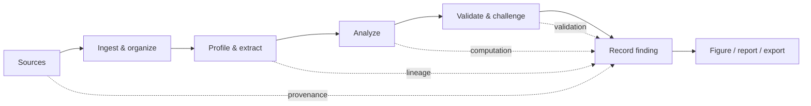

<div align="center">

# Throughline

### Research software for turning sources into traceable evidence.

**Local-first · evidence-first · reproducible by design**

[](https://github.com/SarthakPattnaik1/throughline-os/actions/workflows/ci.yml)
[](https://github.com/SarthakPattnaik1/throughline-os/actions/workflows/codeql.yml)
[](LICENSE)
[](https://www.python.org/)
[](apps/web)

[**Download Throughline**](https://throughline-research.pages.dev) · [**Quick start**](#quick-start) · [**Capabilities**](docs/CAPABILITIES.md) · [**Roadmap**](ROADMAP.md) · [**Contributing**](CONTRIBUTING.md)

</div>

---

## Research should have a throughline

A paper, a dataset, an analysis, a figure, and a finding should not become five disconnected files—or disappear into a chat transcript.

**Throughline is a research workspace built around the chain of evidence itself.** It connects source material, datasets, analyses, validation checks, findings, figures, and reports so a researcher can move forward without losing where a conclusion came from.

It is intentionally different from an AI chat wrapper:

| | Throughline |
|---|---|
| **Evidence first** | Findings stay connected to the analyses and sources that support them. |
| **Local first** | Core research workflows run on your machine. Hosted AI is optional and explicit. |
| **Statistics stay deterministic** | Language models do not invent numerical research results. Computation happens in the scientific runtime. |
| **Provenance is a product feature** | Analyses, versions, lineage, validation, and communication artifacts remain traceable. |
| **Refusal is allowed** | When evidence is missing, incompatible, or insufficient, the system is designed to say so rather than manufacture certainty. |

> [!IMPORTANT]
> **Throughline is an early research release.** It is not medical or clinical decision software. Review statistical conclusions independently, and use synthetic or non-sensitive data when evaluating a new installation.

**Current packaged release:** `v0.3.0`  
**Installer / download host:** https://throughline-research.pages.dev

---

## From source to finding



The working loop is simple:

1. **Add sources** — papers, documents, and datasets.
2. **Profile and understand the material** — types, units, distributions, missingness, passages, and metadata.
3. **Generate or define analyses** — including discovery workflows with multiple-comparison correction.
4. **Challenge the result** — resampling, sensitivity checks, missingness checks, outliers, and selected confounder adjustment.
5. **Record a finding** — connected to the analysis and evidence that produced it.
6. **Communicate it** — figures and reports preserve the research chain instead of flattening it into detached prose.

The deterministic path works without an AI provider. Model-assisted reading, labeling, comparison, and interpretation are optional layers around—not replacements for—the recorded computation.

---

## What you can do today

### Dataset-first research

The dataset-first path works end to end: import a dataset, profile it, explore it, analyze it, validate the result, record a finding, and communicate the finding through the product.

### Paper and evidence workflows

Throughline can ingest papers, preserve passages and citations, locate research claims, compare evidence, connect papers to analyses, and build provenance-aware outputs. Paper/topic-first journeys are still being re-verified as complete user flows on clean installations; individual components having tests is not treated as proof that the entire journey is finished.

### Research integrity mechanisms

The project includes mechanisms for project isolation, analysis provenance, lineage, multiple-comparison correction, validation, sensitivity checks, reproducible analysis specifications, report generation, backup/restore, capability reporting, and explicit AI data-boundary controls.

For the detailed truth table, use [**`docs/CAPABILITIES.md`**](docs/CAPABILITIES.md). For incomplete or planned work, see [**`ROADMAP.md`**](ROADMAP.md) and [**`docs/REQUIREMENTS.md`**](docs/REQUIREMENTS.md).

---

# Quick start

## macOS / Linux

```bash
curl -fsSL https://throughline-research.pages.dev/install.sh | sh
```

The command downloads and executes the installer. If you prefer to inspect it first, download `install.sh`, review it, and run it locally.

## Windows

There is no `sh` on a stock Windows installation, so use PowerShell instead:

```powershell
irm https://throughline-research.pages.dev/install.ps1 | iex
```

## From source

```bash
git clone https://github.com/SarthakPattnaik1/throughline-os.git
cd throughline-os
python scripts/manage.py bootstrap
python scripts/manage.py dev
```

Then open:

```text
http://localhost:8080
```

Run installation diagnostics with:

```bash
python scripts/manage.py doctor
```

`bootstrap` obtains the Python runtime Throughline expects when needed, creates the environment, installs the workspace packages, applies migrations, and builds the web interface.

---

## Local-first does not mean AI-first

Throughline can run with **no language model configured**.

| Provider | Where it runs | What happens |
|---|---|---|
| `none` | Nowhere | Model features are unavailable; deterministic research workflows continue to work. |
| `ollama` | Local by default | Model-assisted features can run on the researcher's machine. |
| `anthropic` | Hosted | Selected research text is sent to the configured hosted provider. |

There is **no silent fallback from local/offline operation to a hosted provider**. Sending research material to an external model must be an explicit configuration choice.

Example hosted configuration:

```bash
export THROUGHLINE_MODEL_PROVIDER=anthropic
export ANTHROPIC_API_KEY=...
```

A missing or unreachable optional provider is represented as an unavailable capability rather than being allowed to break unrelated research workflows.

---

## Design principles

### 1. A model does not get to become the calculator

Language models may help interpret, classify, locate, compare, or explain. Numerical research results come from recorded computation, not generated prose.

### 2. Retrieved text is data, not instruction

Papers and other retrieved material cross an explicit trust boundary before model use. Content inside a document is treated as untrusted research material rather than as authority over the application.

### 3. Missing evidence is not evidence

A failed request, missing provider, skipped test, absent citation, or unavailable check is represented as missing verification—not quietly promoted into a successful result.

### 4. Local-first includes recovery

If the researcher's machine holds the only copy of a project, backup and restoration are part of the product contract.

### 5. Security belongs on the server

Project ownership, administrative permissions, account isolation, and installation-wide actions are enforced server-side rather than trusted to the interface.

---

## Architecture at a glance

```text
┌──────────────────────────────────────────────────────────────┐
│                     Researcher interface                     │
│                    Next.js / React / D3                      │
└─────────────────────────────┬────────────────────────────────┘
                              │ same origin
┌─────────────────────────────▼────────────────────────────────┐
│                         FastAPI API                          │
│          auth · projects · workflows · capabilities          │
└───────────────┬─────────────────────────────┬────────────────┘
                │                             │
┌───────────────▼──────────────┐  ┌───────────▼────────────────┐
│       Research domain        │  │     Scientific runtime      │
│ evidence · lineage · claims  │  │ deterministic computation  │
│ findings · reports · models  │  │ sandboxed analysis paths   │
└───────────────┬──────────────┘  └────────────────────────────┘
                │
┌───────────────▼──────────────────────────────────────────────┐
│                 PostgreSQL + object storage                  │
│               local project data + provenance               │
└──────────────────────────────────────────────────────────────┘
```

The API and interface are served from one origin on port `8080`. Authentication uses an `httpOnly`, `SameSite=strict` session cookie.

The application runtime targets **Python 3.12**. Node is used to build the web interface from source; the built interface is served by the Python application and does not require a separate Node server at runtime.

PostgreSQL is provided through the project's database runtime rather than requiring a separately managed database installation for the normal local setup.

---

## Repository map

```text
apps/
  api/                  FastAPI HTTP surface
  web/                  Next.js researcher interface

packages/
  schemas/              Versioned domain schemas
  model/                Model providers + prompt contracts
  research-domain/      Evidence, analyses, lineage, findings, workflows
  connector-sdk/        Connector interfaces + capability model
  ingestion/            Document and dataset ingestion
  visual-spec/          Visualization specification + rendering

services/
  workers/              Durable background work
  scientific-runtime/   Isolated analysis execution

docs/                   Architecture, capabilities, requirements, release evidence
tests/                  Cross-package regression and invariant tests
evals/                  Evaluation harness
scripts/                Bootstrap, diagnostics, release, backup, verification
```

New research logic belongs in the domain packages rather than React components or HTTP handlers. New API surfaces should use focused router modules instead of further concentrating routes in `apps/api/src/throughline_api/app.py`.

---

## Security and project isolation

The first account on an installation is the administrator. Installation-wide operations are protected by server-side role checks.

Network sign-up is off by default. Project ownership is checked server-side, and the test suite exercises object identifiers across account/project boundaries so another account's object cannot simply be reached by knowing its ID.

Security-sensitive routes should preserve a simple rule: **another account's private object should generally be indistinguishable from an object that does not exist.**

Please report vulnerabilities privately as described in [**`SECURITY.md`**](SECURITY.md).

> [!CAUTION]
> Do not put private datasets, unpublished research, credentials, database exports, session cookies, API keys, or personal information into public GitHub issues or pull requests.

---

## Optional capability packs

Large or specialized dependencies are kept out of the base install where possible. Capabilities are surfaced through the product so a missing optional dependency becomes an explainable unavailable feature rather than an opaque crash.

This is especially important for features such as local speech recognition and other ML-heavy tooling that may add gigabytes of dependencies but are not required for the core research path.

---

## Backup and restore

A local-first workspace needs a real recovery story.

```bash
./scripts/backup.sh
./scripts/restore.sh <archive.tar> [--force]
```

Backups include the database and object store together because rows and files reference one another. Restore rehearsal is part of the release-readiness process.

---

## Docker

The current container path targets `linux/amd64`.

```bash
docker build -t throughline-os .
docker run \
  -p 127.0.0.1:8080:8080 \
  -v throughline:/data \
  throughline-os
```

Then open `http://localhost:8080`.

The mounted volume is what makes the research corpus durable. A fresh container without the data volume is a fresh local workspace.

On Apple Silicon, the native bootstrap path is currently preferred over relying on x86 emulation for the embedded database/pgvector stack.

---

## Updates

Updates are deliberate rather than automatic:

```bash
python scripts/manage.py update --check
python scripts/manage.py update
```

The updater backs up before migration, uses fast-forward semantics, and reports recovery information when an update cannot complete cleanly.

The running product also reports its software version/source so a research result can be tied back to the code that produced it.

---

## Testing

Run the full local preflight:

```bash
python scripts/manage.py preflight
```

Or run suites directly:

```bash
.venv/bin/python -m pytest tests -q
cd apps/web && npm test
```

The repository currently records **2,828 backend tests and 3,712 web tests**. The backend count is guarded against both overstatement and excessive drift; the web suite also has an offline floor check in the backend tests.

Pull requests to `main` are checked across the major product surfaces:

- **Ubuntu** backend suite
- **macOS** backend suite
- **Windows** sandbox/confinement checks
- **Web** tests, lint, and production build
- **Docker** build and in-container health check
- **CodeQL** static analysis

A skipped, cancelled, infrastructure-blocked, or billing-refused workflow is **missing verification**, not a passing result.

---

## Release readiness

Public source code and a verified release are different claims.

Before calling a commit release-ready, follow [**`docs/PUBLIC_RELEASE_GATE.md`**](docs/PUBLIC_RELEASE_GATE.md). The gate covers cross-platform CI, clean-install rehearsal, account isolation, history/secret review, dependency review, backup/restore rehearsal, and release-signature checks.

Build release artifacts with:

```bash
python scripts/manage.py release
```

The release builder uses an allowlist of paths, refuses a dirty checkout, emits a SHA-256 digest and manifest, and supports signed update verification. See [`keys/README.md`](keys/README.md) for signing details.

---

## Contributing

Throughline welcomes careful contributions—especially work that improves research correctness, reproducibility, usability, security, accessibility, and evidence traceability.

Start here:

- [**`CONTRIBUTING.md`**](CONTRIBUTING.md) — development and review workflow
- [**`CODE_OF_CONDUCT.md`**](CODE_OF_CONDUCT.md) — community expectations
- [**`SUPPORT.md`**](SUPPORT.md) — bugs, support, and scientific-correctness reports
- [**`SECURITY.md`**](SECURITY.md) — private vulnerability reporting

For substantial features or architectural changes, open an issue before implementation so the problem, research-integrity implications, and interfaces can be discussed before code hardens around them.

---

## Documentation

| Document | Use it for |
|---|---|
| [`docs/CAPABILITIES.md`](docs/CAPABILITIES.md) | What the product can do now |
| [`ROADMAP.md`](ROADMAP.md) | Planned and incomplete work |
| [`docs/REQUIREMENTS.md`](docs/REQUIREMENTS.md) | Status against the broader specification |
| [`TASKS.md`](TASKS.md) | Current task/evidence ledger |
| [`CONTRIBUTING.md`](CONTRIBUTING.md) | Contribution workflow |
| [`SECURITY.md`](SECURITY.md) | Security model and vulnerability reporting |
| [`SUPPORT.md`](SUPPORT.md) | Support and issue reporting |
| [`docs/PUBLIC_RELEASE_GATE.md`](docs/PUBLIC_RELEASE_GATE.md) | Evidence required for release readiness |

Historical planning documents are useful context, but current behavior should be judged from code, tests, the capability/requirements ledgers, and evidence for the exact commit under review.

---

## License

Throughline is open source under the **Apache License 2.0**. See [LICENSE](LICENSE).

<div align="center">

**Build research that can explain where it came from.**

[Download](https://throughline-research.pages.dev) · [Contribute](CONTRIBUTING.md) · [Security](SECURITY.md) · [Roadmap](ROADMAP.md)

</div>
