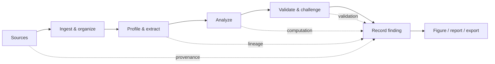
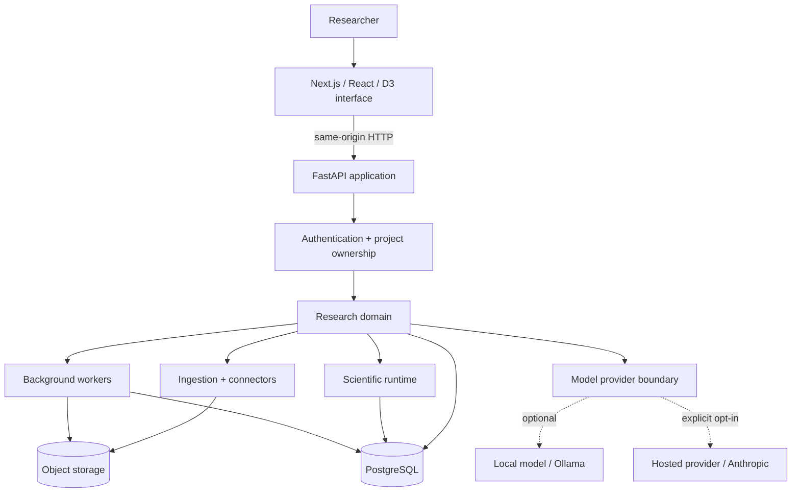
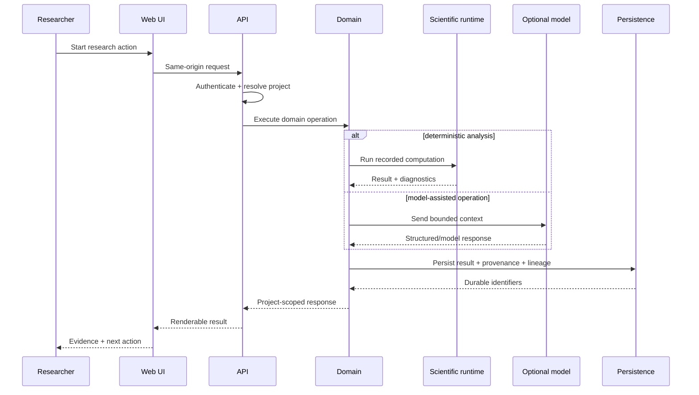
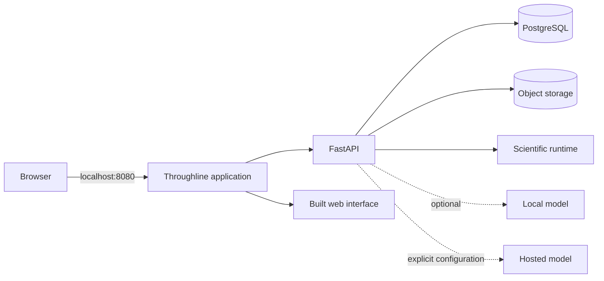

<div align="center">

# Throughline

### Turn research material into evidence you can trace, challenge, and reproduce.

**Local-first research software for papers, datasets, analysis, validation, findings, figures, and reports.**

<br />

[](https://github.com/SarthakPattnaik1/throughline-os/actions/workflows/ci.yml)
[](https://github.com/SarthakPattnaik1/throughline-os/actions/workflows/codeql.yml)
[](LICENSE)
[](https://www.python.org/)
[](apps/web)
[](https://throughline-research.pages.dev)

<br />

[**Download Throughline**](https://throughline-research.pages.dev) · [**Quick start**](#quick-start) · [**What it can do**](#what-throughline-can-do-today) · [**Architecture**](#system-design--engineering-architecture) · [**Capabilities**](docs/CAPABILITIES.md) · [**Roadmap**](ROADMAP.md) · [**Contribute**](CONTRIBUTING.md)

</div>

---

## Research should have a throughline

A paper, dataset, analysis, figure, and conclusion should not become five disconnected files—or disappear into a chat transcript.

**Throughline keeps the chain of evidence intact.** Sources stay connected to datasets; datasets stay connected to analyses; analyses stay connected to validation; findings stay connected to the evidence that supports them; and reports preserve those links instead of flattening everything into detached prose.

| **Evidence stays attached** | **Computation stays deterministic** | **Your machine stays in control** |
|---|---|---|
| Findings preserve links to their sources, analyses, lineage, and validation. | Numerical research results come from recorded scientific computation, not generated text. | Core workflows run locally. Hosted AI is optional, explicit, and never a silent fallback. |

> [!IMPORTANT]
> **Throughline is an early research release.** It is not medical or clinical decision software. Review statistical conclusions independently, and use synthetic or non-sensitive data when evaluating a new installation.

<div align="center">

**Current packaged release:** `v0.3.0` · **License:** Apache 2.0 · **Runtime:** Python 3.12

</div>

---

## From source to finding



The core workflow is deliberately simple:

1. **Add sources** — papers, documents, and datasets.
2. **Profile and understand them** — types, units, distributions, missingness, passages, and metadata.
3. **Generate or define analyses** — including discovery workflows with multiple-comparison correction.
4. **Challenge the result** — resampling, sensitivity checks, missingness checks, outlier checks, and selected confounder adjustment.
5. **Record a finding** — connected to the analysis and evidence that produced it.
6. **Communicate it** — figures and reports preserve the research chain instead of discarding it.

The deterministic path works without an AI provider. Model-assisted reading, labeling, comparison, and interpretation are optional layers around the recorded computation—not replacements for it.

---

## What Throughline can do today

| Area | Current capability |
|---|---|
| **Dataset-first research** | Import → profile → explore → analyze → validate → record a finding → communicate it. |
| **Paper workflows** | Ingest documents, preserve passages/citations, locate claims, compare evidence, and connect papers to analyses. |
| **Discovery** | Test candidate relationships and correct for multiple comparisons rather than treating every raw p-value as independent evidence. |
| **Validation** | Re-run results under resampling, outlier, missingness, sensitivity, and selected confounder checks. |
| **Provenance & lineage** | Keep analyses, sources, findings, artifacts, and their derivations traceable. |
| **Communication** | Build provenance-aware figures, reports, and exports from recorded evidence. |
| **Recovery** | Back up and restore the database and object store together. |
| **AI assistance** | Optional model-assisted reading and interpretation with explicit provider boundaries. |

### What is still being verified

The **dataset-first path works end to end**. Paper/topic-first journeys are being re-walked on clean installations before they are described as complete end-to-end user flows. Individual components having tests is not treated as proof that the entire journey is finished.

For the detailed truth table, use [**`docs/CAPABILITIES.md`**](docs/CAPABILITIES.md). For planned or incomplete work, see [**`ROADMAP.md`**](ROADMAP.md) and [**`docs/REQUIREMENTS.md`**](docs/REQUIREMENTS.md).

---

# Quick start

### macOS / Linux

```bash
curl -fsSL https://throughline-research.pages.dev/install.sh | sh
```

The command downloads and executes the installer. If you prefer to inspect it first, download `install.sh`, review it, and run it locally.

### Windows

There is no `sh` on a stock Windows installation, so use PowerShell instead:

```powershell
irm https://throughline-research.pages.dev/install.ps1 | iex
```

### Open Throughline

The application is served locally at:

```text
http://localhost:8080
```

<details>
<summary><strong>Install from source</strong></summary>

<br />

```bash
git clone https://github.com/SarthakPattnaik1/throughline-os.git
cd throughline-os
python scripts/manage.py bootstrap
python scripts/manage.py dev
```

Run installation diagnostics with:

```bash
python scripts/manage.py doctor
```

`bootstrap` obtains the Python runtime Throughline expects when needed, creates the environment, installs the workspace packages, applies migrations, and builds the web interface.

</details>

<details>
<summary><strong>Run with Docker</strong></summary>

<br />

The current container path targets `linux/amd64`.

```bash
docker build -t throughline-os .
docker run \
  -p 127.0.0.1:8080:8080 \
  -v throughline:/data \
  throughline-os
```

The mounted volume keeps the research corpus durable. A fresh container without the data volume is a fresh local workspace.

On Apple Silicon, the native bootstrap path is currently preferred over relying on x86 emulation for the embedded database/pgvector stack.

</details>

---

## Why Throughline is different

### Evidence first—not chat first

Throughline is built around research objects and the relationships between them. A conclusion should be inspectable after the conversation, notebook cell, or browser tab that produced it is gone.

### Statistics stay in the scientific runtime

Language models may help interpret, classify, locate, compare, or explain. **They do not get to become the calculator.** Numerical research results come from deterministic, recorded computation.

### Missing evidence stays missing

A failed request, missing provider, skipped test, absent citation, unavailable check, or infrastructure failure is represented as missing verification—not quietly promoted into a successful result.

### Refusal is a valid outcome

When evidence is incompatible or insufficient, the system is designed to say so rather than manufacture certainty.

### Recovery is part of local-first

If the researcher's machine holds the project, backup and restoration are part of the product contract—not an afterthought.

---

## AI is optional

Throughline can run with **no language model configured**.

| Provider | Where it runs | Behavior |
|---|---|---|
| `none` | Nowhere | Model features are unavailable; deterministic research workflows continue to work. |
| `ollama` | Local by default | Model-assisted features can run on the researcher's machine. |
| `anthropic` | Hosted | Selected research text is sent to the configured hosted provider. |

There is **no silent fallback from local/offline operation to a hosted provider**. Sending research material to an external model must be an explicit configuration choice.

```bash
export THROUGHLINE_MODEL_PROVIDER=anthropic
export ANTHROPIC_API_KEY=...
```

Retrieved papers and other external content are treated as **untrusted research material**, not as instructions with authority over the application.

---

## System design & engineering architecture

Throughline is designed as a **local-first research system with explicit trust boundaries**. The interface is intentionally thin; research rules live in domain packages; numerical work is delegated to the scientific runtime; optional model providers sit behind a separate boundary; and durable state is stored together with the provenance needed to explain how it was produced.

### Component topology



### Engineering boundaries

| Layer | Responsibility | What should **not** live there |
|---|---|---|
| **Web interface** | Researcher workflows, interaction state, visualization, presentation | Ownership enforcement, scientific truth, or hidden business rules |
| **FastAPI surface** | HTTP contracts, authentication entry points, request orchestration, capability exposure | Core research logic embedded directly in route handlers |
| **Research domain** | Evidence, claims, analyses, findings, lineage, validation, workflow rules | Browser-specific behavior or provider-specific UI concerns |
| **Scientific runtime** | Deterministic analysis and numerical computation | Free-form model reasoning presented as statistical output |
| **Ingestion / connectors** | Bring papers, files, datasets, and external metadata across controlled boundaries | Treating retrieved content as trusted instructions |
| **Model layer** | Optional reading, extraction, labeling, comparison, and interpretation | Becoming the source of numerical research results or silently calling hosted services |
| **Schemas** | Versioned contracts between packages and persisted structures | Unversioned ad-hoc dictionaries crossing subsystem boundaries |
| **Workers** | Durable background work that should survive the request that initiated it | UI-only state or security decisions that belong in the API/domain layer |
| **PostgreSQL + object storage** | Durable project state, metadata, artifacts, and provenance-linked files | Being treated as independent stores whose backups can safely drift apart |

### Request and data flow



The important architectural property is that **the result returned to the interface is not the only record of what happened**. Analyses, findings, artifacts, validation results, and relationships are persisted so the system can later explain where a conclusion came from.

### Data and trust model

Throughline separates four different kinds of trust:

1. **User/session trust** — who is making the request.
2. **Project ownership** — whether the requested object belongs to that user's project.
3. **Research evidence** — what sources, datasets, analyses, and validation support a finding.
4. **External/model input** — content that may be useful, but is not automatically authoritative.

Ownership checks are enforced server-side. Retrieved documents are treated as data. Hosted-model use is explicit. Numerical results come from deterministic computation. Those boundaries are intended to remain visible in both code and product behavior.

### Local deployment model



The normal application is presented through one local origin on port `8080`. Authentication uses an `httpOnly`, `SameSite=strict` session cookie. Node is used to build the web interface from source; the built interface is served by the Python application rather than requiring a second development server at runtime.

### Architectural invariants

Contributions should preserve these rules:

- **Project isolation is server-side.** A UI filter is not an authorization boundary.
- **Research logic belongs below the HTTP layer.** Route handlers should orchestrate rather than become the domain model.
- **Numerical results are reproducible computations.** A language model can describe a result; it does not manufacture the result.
- **Provenance is written with the work.** A result should not need reconstruction from logs or chat history to explain its origin.
- **External text is untrusted input.** A paper, webpage, or retrieved document cannot instruct the application simply because it contains imperative language.
- **Optional capabilities fail explicitly.** Missing models or heavy capability packs should degrade to an unavailable capability, not break unrelated workflows.
- **Database and object storage form one recovery unit.** Backups and restores keep them consistent.
- **Missing verification is not success.** CI, release, and research evidence follow the same rule.

### Current engineering pressure points

The repository is actively moving toward smaller, more focused boundaries. In particular, `apps/api/src/throughline_api/app.py` is still substantially larger than the desired end state. New API work should prefer focused router/modules and domain services instead of making that file more central.

---

## Repository map

```text
apps/
  api/                  FastAPI HTTP surface
  web/                  Next.js researcher interface

packages/
  schemas/              Versioned domain schemas
  model/                Model providers + prompt contracts
  research-domain/      Evidence, analyses, lineage, findings, workflows
  connector-sdk/        Connector interfaces + capability model
  ingestion/            Document and dataset ingestion
  visual-spec/          Visualization specification + rendering

services/
  workers/              Durable background work
  scientific-runtime/   Isolated analysis execution

docs/                   Architecture, capabilities, requirements, release evidence
tests/                  Cross-package regression and invariant tests
evals/                  Evaluation harness
scripts/                Bootstrap, diagnostics, release, backup, verification
```

New research logic belongs in domain packages rather than React components or HTTP handlers. New API surfaces should use focused router modules instead of further concentrating routes in `apps/api/src/throughline_api/app.py`.

---

## Security and project isolation

The first account on an installation is the administrator. Installation-wide operations are protected by server-side role checks.

Network sign-up is off by default. Project ownership is checked server-side, and the test suite exercises object identifiers across account/project boundaries so another account's object cannot simply be reached by knowing its ID.

Security-sensitive routes should preserve a simple rule: **another account's private object should generally be indistinguishable from an object that does not exist.**

Please report vulnerabilities privately as described in [**`SECURITY.md`**](SECURITY.md).

> [!CAUTION]
> Do not put private datasets, unpublished research, credentials, database exports, session cookies, API keys, or personal information into public GitHub issues or pull requests.

---

## Backup, restore, and updates

### Backup / restore

```bash
./scripts/backup.sh
./scripts/restore.sh <archive.tar> [--force]
```

Backups include the database and object store together because rows and files reference one another. Restore rehearsal is part of release readiness.

### Updates

Updates are deliberate rather than automatic:

```bash
python scripts/manage.py update --check
python scripts/manage.py update
```

The updater backs up before migration, uses fast-forward semantics, and reports recovery information when an update cannot complete cleanly.

---

## Testing and verification

Run the full local preflight:

```bash
python scripts/manage.py preflight
```

Or run suites directly:

```bash
.venv/bin/python -m pytest tests -q
cd apps/web && npm test
```

The repository currently records **2,857 backend tests and 3,712 web tests**. The backend count is guarded against both overstatement and excessive drift; the web suite also has an offline floor check in the backend tests.

Pull requests to `main` are checked across the major product surfaces:

| Check | What it protects |
|---|---|
| **Ubuntu** | Full backend suite + skip accounting |
| **macOS** | Full backend suite + skip accounting |
| **Windows** | Sandbox / confinement behavior |
| **Web** | Tests, lint, and production build |
| **Docker** | Image build + in-container health check |
| **CodeQL** | Static security analysis |

> [!NOTE]
> A skipped, cancelled, infrastructure-blocked, or billing-refused workflow is **missing verification**, not a passing result.

---

## Release readiness

Public source code and a verified release are different claims.

Before calling a commit release-ready, follow [**`docs/PUBLIC_RELEASE_GATE.md`**](docs/PUBLIC_RELEASE_GATE.md). The gate covers cross-platform CI, clean-install rehearsal, account isolation, history/secret review, dependency review, backup/restore rehearsal, and release-signature checks.

Build release artifacts with:

```bash
python scripts/manage.py release
```

The release builder uses an allowlist of paths, refuses a dirty checkout, emits a SHA-256 digest and manifest, and supports signed update verification. See [`keys/README.md`](keys/README.md) for signing details.

---

## Contributing

Throughline welcomes careful contributions—especially work that improves research correctness, reproducibility, usability, security, accessibility, and evidence traceability.

| Start here | Purpose |
|---|---|
| [**Contributing**](CONTRIBUTING.md) | Development setup, review workflow, and contribution expectations |
| [**Code of Conduct**](CODE_OF_CONDUCT.md) | Community expectations |
| [**Support**](SUPPORT.md) | Bugs, support, and scientific-correctness reports |
| [**Security**](SECURITY.md) | Private vulnerability reporting |

For substantial features or architectural changes, open an issue before implementation so the problem, research-integrity implications, and interfaces can be discussed before code hardens around them.

---

## Documentation

| Document | Use it for |
|---|---|
| [`docs/CAPABILITIES.md`](docs/CAPABILITIES.md) | What the product can do now |
| [`ROADMAP.md`](ROADMAP.md) | Planned and incomplete work |
| [`docs/REQUIREMENTS.md`](docs/REQUIREMENTS.md) | Status against the broader specification |
| [`TASKS.md`](TASKS.md) | Current task/evidence ledger |
| [`CONTRIBUTING.md`](CONTRIBUTING.md) | Contribution workflow |
| [`SECURITY.md`](SECURITY.md) | Security model and vulnerability reporting |
| [`SUPPORT.md`](SUPPORT.md) | Support and issue reporting |
| [`docs/PUBLIC_RELEASE_GATE.md`](docs/PUBLIC_RELEASE_GATE.md) | Evidence required for release readiness |

Historical planning documents are useful context, but current behavior should be judged from code, tests, the capability/requirements ledgers, and evidence for the exact commit under review.

---

## License

Throughline is open source under the **Apache License 2.0**. See [LICENSE](LICENSE).

<br />

<div align="center">

### Build research that can explain where it came from.

[**Download Throughline**](https://throughline-research.pages.dev) · [**Explore capabilities**](docs/CAPABILITIES.md) · [**Contribute**](CONTRIBUTING.md) · [**Security**](SECURITY.md)

</div>
